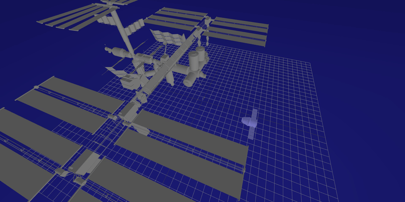

# CMU_16-745_2024spring
This repository contains all the projects for the CMU 16-745 course in Spring 2024.

## Homework 1
This homework focuses on using Newton's method to solve optimization problems with constraints.

- **Q2:** Line search is applied to prevent overshooting. The goal is to find the balance position of a quadruped robot.

    
    
    <figcaption>Initial and balanced positions of the quadruped robot</figcaption>

- **Q3:** Implement a Quadratic Programming (QP) solver to simulate the motion of a falling block. At each timestep, use the QP solver to determine the optimal velocity for the next timestep and update the block's position using the dynamic equations.

    
    <figcaption>Simulate the block with an initial speed and slide on the ice</figcaption>

## Homework 2
This homework focuses on LQR/MPC and uses them for trajectory following. It explores using Ricatti Recursion and Dynamic Programming to solve LQR without constraints. `ECOS` is used to solve LQR with constraints and MPC.

- **Q2:** To use LQR to control the cartpole, linearization must be applied. For time-invariant LQR, as shown in the left figure, the cartpole can only be balanced near the goal position because the linearization is inaccurate for large angles. For time-variant LQR (TVLQR), as shown in the right figure, it functions like trajectory following. Linearization is performed at each timestep, so it is not limited by the initial position.

    
    
    <figcaption>Use LQR to balance cartpole</figcaption>

- **Q3:** The figures from left to right illustrate the rendezvous task between SpaceX Dragon and the ISS using LQR, LQR with constraints, and MPC, respectively. LQR has an analytical solution, resulting in low computational complexity. However, when constraints are added, LQR must be solved as a standard QP problem. In this case, all control inputs `U` for all timesteps are computed simultaneously based on the entire reference trajectory `X_ref`. MPC, on the other hand, calculates the next control input `u[1]` based on the reference trajectory for the next `N` timesteps `X_ref[1:N]`, and the subsequent control input `u[2]` is computed based on `X_ref[2:N+1]`. MPC is used for real-time control, enabling closed-loop control.

    
    
    
    <figcaption>Implement randezvous task</figcaption>

