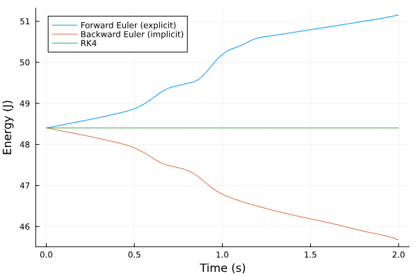

# CMU_16-745_2024spring
This repository contains all the projects for the CMU 16-745 course in Spring 2024.

## Homework 1
This homework focuses on how to solve a optimization problem.

- **Q1:** This question compares various methods for discretizing the dynamic function. As illustrated in the figure, the forward Euler method tends to make the system more unstable by increasing energy, while the backward Euler method tends to make the system more stable by reducing energy.

    
    <figcaption>Compare the different discretization methods</figcaption>

- **Q2:** This question involves using Newton's method with line search to develop a solver for optimization problems with equality constraints. The solver is then applied to find the balanced position of a quadruped robot, using zero acceleration as the constraint.

    
    
    <figcaption>Initial and balanced positions of the quadruped robot</figcaption>

- **Q3:** This question implements a Quadratic Programming `QP` solver using augmented Lagrangian method to simulate the motion of a falling block. At each timestep, use the QP solver to determine the optimal velocity for the next timestep and update the block's position using the dynamic equations.

    
    <figcaption>Simulate the block with an initial speed and slide on the ice</figcaption>

## Homework 2
This homework focuses on the application of LQR and MPC for stabilization and trajectory following. While LQR can be solved using dynamic programming efficiently, it cannot handle constraints. To address this, MPC is formulated as a convex QP optimization problem and solved using `ECOS`.

- **Q1:** This question compares solving a quadratic cost function using convex optimization and LQR. When the dynamic model has no noise, both methods have same results, as shown in the left figure. However, when the dynamic model includes noise, only LQR can reach the goal position, as depicted in the right figure.

    
    
    <figcaption>CVX optimization vs LQR</figcaption>

- **Q2:** To use LQR to control the cartpole, linearization must be applied. For time-invariant LQR, as shown in the left figure, the cartpole can only be balanced near the goal position because the linearization is inaccurate for large angles. For time-variant LQR (TVLQR), as shown in the right figure, it functions like trajectory following. Linearization is performed at each timestep, so it is not limited by the initial position.

    
    
    <figcaption>Use LQR to balance cartpole</figcaption>

- **Q3:** The figures from left to right depict the rendezvous task between SpaceX Dragon and the ISS using LQR, convex optimization, and MPC, respectively. LQR offers an analytical solution with low computational complexity. However, when constraints are introduced, the control problem must be formulated as a standard QP problem. In this scenario, all control inputs `U` for all timesteps are computed simultaneously based on the entire reference trajectory `X_ref`. Conversely, MPC calculates the next control input `u[1]` based on the reference trajectory for the next `N` timesteps `X_ref[1:N]` using the QP optimization method with the `ECOS` solver. The subsequent control input `u[2]` is then computed based on `X_ref[2:N+1]`. MPC is utilized for real-time control, enabling closed-loop control.

    
    
    
    <figcaption>Implement randezvous task</figcaption>

## Homework 3
This homework focuses on solving non-linear programming (NLP) problems using `Differential Dynamic Programming (DDP)` and `Direct Collocation (DC)`. `DDP` is a method for solving optimal control problems by iteratively improving the control policy. `DC` transforms the quadratic problem into a Sequential Quadratic Programming (SQP) problem.

- **Q1:** In this question, the direct collocation method is first used to generate the trajectory for balancing the cartpole, as shown in the left figure. An initial guess is provided for the `IPOPT` solver to ensures convergence for the `DC` method. Subsequently, TVLQR is employed to follow the generated trajectory, as depicted in the right figure. This involves discretizing matrices A and B at each timestep, calculating the gain matrix K and the cost-to-go matrix P at each timestep, and applying feedback control. The reference trajectory is the one generated by the direct collocation method.

    
    
    <figcaption>Use DC to generate trajectory and DP to control</figcaption>

    
    
    <figcaption>Use different parameters for simulation to test the control method</figcaption>

- **Q2:** The left figure illustrates the trajectory generated by `DDP`. The computed gain `K` can be utilized as feedback control to guide the quadrotor as shown in right figure.

    
    
    <figcaption>Use DDP to generate trajectory and control</figcaption>

    
    
    <figcaption>Use different parameters for simulation to test the control method</figcaption>

- **Q3:** This question involves driving three planar quadrotors from different initial positions to different goals while ensuring there are no collisions. The `DC` method is used to generate trajectories and feedforward controls for the three quadrotors. The states of the three quadrotors are combined into a single state vector `X`, and the controls are combined into a single control vector `U`. These vectors are then combined into a single vector `Z`, which is sent to `IPOPT` to solve the problem. The left figure shows the trajectories without collision constraints, resulting in collisions. The right figure includes collision inequality constraints to prevent collisions.

    
    
    <figcaption>Multi agents motion planning</figcaption>

## Homework 4
This homework introduces iterative learning control to optimize the feed forward control and hybrid systems modeling with contact dynamics.

- **Q1:** The objective of this problem is to control the car to follow a generated trajectory. Due to the sim-to-real gap in the dynamic model (with a deterministic environment), the actual trajectory deviates significantly from the reference trajectory, as shown in the left figure. To address this, Iterative Learning Control (ILC) can be employed to optimize the feedforward control. The cost function aims to minimize the differences (ΔX and ΔU) between the actual and reference trajectories. The constraints include dynamic and control constraints. The problem is solved using `ECOS.Optimizer` to obtain ΔU, which is iteratively added to the original control input U until convergence is achieved.

    
    
    <figcaption>Trajectory following before and after iterative learning control</figcaption>

    
    <figcaption>Simulate the car following the trajectory</figcaption>

- **Q2:** Similar to the `DC` method in Homework 3, the `IPOPT` solver is used to solve this problem. The bipedal robot needs to contact the ground, resulting in different dynamic formulations when the robot is in contact with the surface. A jump map is required to change the velocity's direction during state transitions. In this problem, there is no state detection method, state changes are enforced every five timesteps (take one leg as example, 0.5s in ground, 0.5s in air). 

    
    <figcaption>Simulate the bipedal robot following the trajectory</figcaption>

